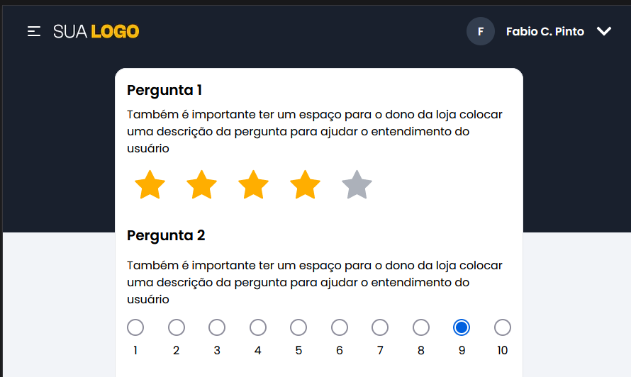
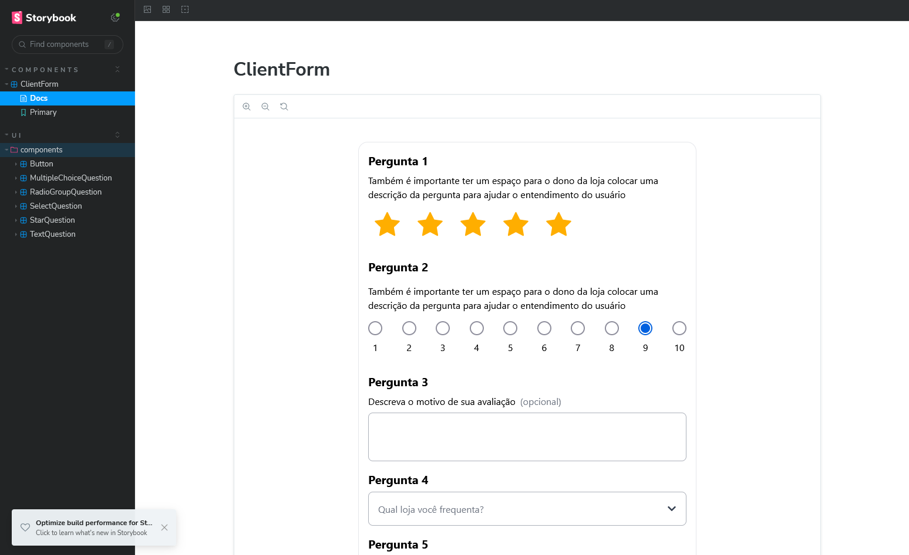

  
   

  <h1>Fidelimax frontend Test</h1>

  
If you want to see the website, 
    <a href='https://fidelimax-frontend-test.vercel.app/' target='_blank'>click here</a>
  

  

## Summary

- [How to install this project](#install)
- [Load docs using storybook and run unit tests](#storybook)

<h2 id='install'>How to install this project</h2>

This project uses node to run, make sure you have the latest version.
After that, download the project and run the following command to download the dependencies and run it on your machine locally

`npm install && npm run dev`

If you just want to view the project,<a href='https://fidelimax-frontend-test.vercel.app/'>click here</a>

<h2 id='storybook'>Load docs using storybook and run unit tests</h2>

To run the documentation and have a deeper understanding of how the project works, run the following command

`npm run storybook`

If everything goes as it should, you will see a screen like this:

  

 

To run unit tests, just run this command:

`npm run test`
